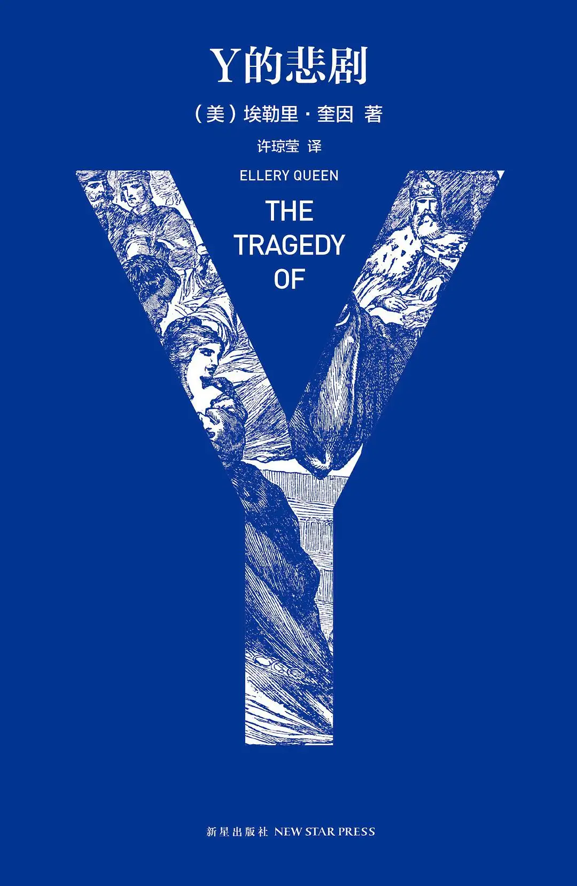
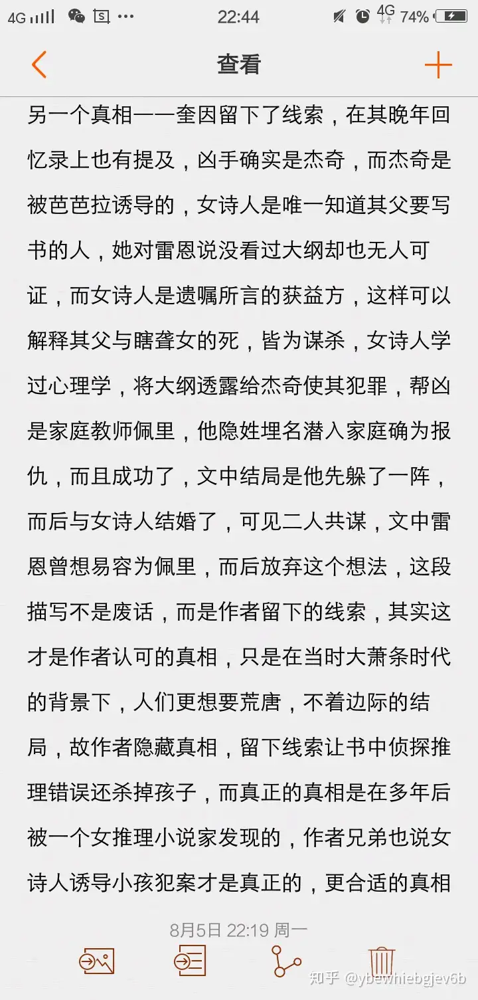

-   
    神中神，目前我心目第一的推理小说，不论是动机手法作案过程都非常强，文笔更是锦上添花，读起来毫不费劲
    
- 梗概：
    
    - 第一位死者，哈特，自杀，化学家
        
    - 第二位死者，哈特夫人
        
    - 手法和线索：
        
        - 哈特创作了一部以自己家庭为原型的推理小说，其中死者为哈特夫人，凶手为哈特，哈特的7岁孙子吉米哈特意外阅读到了这一小说，又因为基因缺陷，吉米哈特患有严重的暴力倾向，最终决定实施犯罪
            
        - 手法大致为：
            
            - 1.在哈特女儿路易莎的蛋奶酒里下毒，然后自己喝掉，以伪装出有人要杀死路易莎的假象
                
            - 2.晚上使用钝器杀死哈特夫人，并在梨里下毒，由于路易莎不吃梨避免真正杀死路易莎，同时可以伪装这是第二次杀路易莎
                
        - 留下的线索：
            
            - 1.凶器为曼陀林琴，这是因为凶手不知道哈特小说中的“钝器”是什么意思
                
            - 2.注射器在地上，这是因为凶手比较蠢，到了现场才下毒
                
            - 3.哈特的一位儿子康托尔的鞋上有粉末，这是哈特的小说中提到的假线索，用于嫁祸
                
            - 4.路易莎闻到了香草味，这是哈特小说中的真线索，哈特本人使用的药膏为香草味的，用于指出小说中的凶手为哈特，然而凶手不知其用意，也伪造了这个线索，导致两个线索分别指向不同人，造成矛盾
                
        - 结局：
            
            - 由于哈特的小说中还有一案，即再次下毒给路易莎，但是避免路易莎喝下去，以此伪造出凶手的目的始终为路易莎，雷恩早已知道凶手是谁，但由于不敢相信，于是他把原本的毒药换为了牛奶，然后躲起来看凶手是否会按小说所写的做，最终发现凶手没有阻止路易莎喝下去，他是真心想要杀死路易莎，雷恩顿悟：凶手已经无药可救了。第二天雷恩选择毒死了凶手
- 追记：神中神中神，原来我被作者骗了两次，只因为我在知乎看到了后话
		
	
    - 家庭教师反对雷恩假扮的原因可能其实是担心扮的太像了，暴露了共犯的事实

[埃勒里·奎因](../../总览/作者/埃勒里·奎因.md)