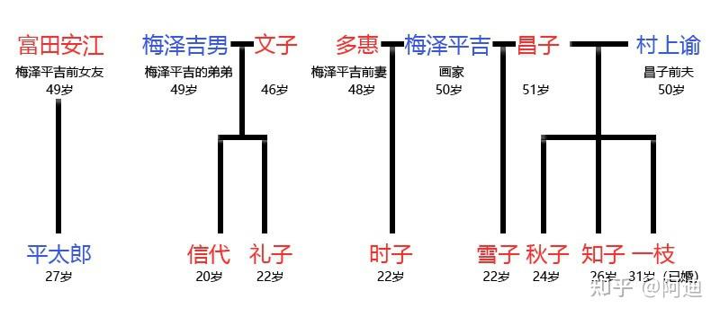
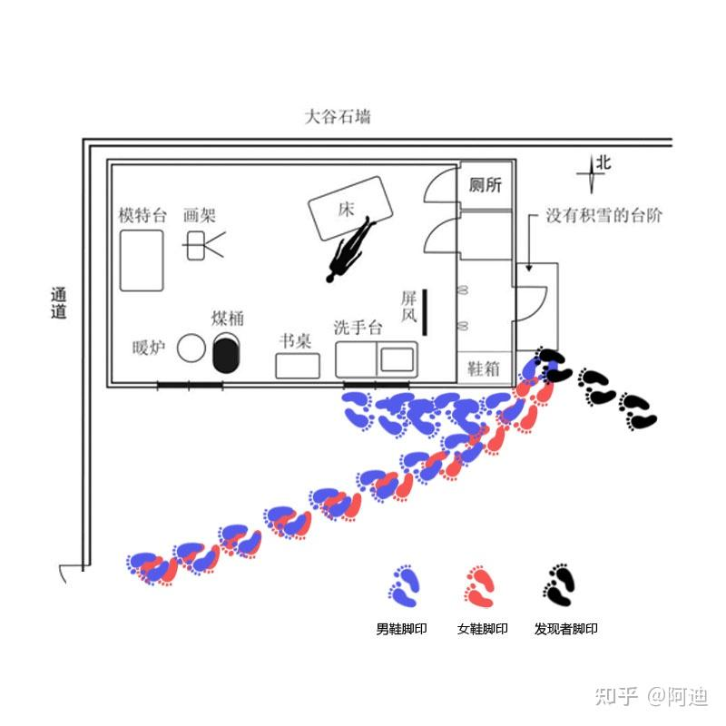

> *“发挥才智，则锋芒毕露；凭借感情，则流于世俗；坚持己见，则多方掣肘。总之，人世难居。”*
---

- 最优秀的诡计之一，唯一的缺点就是作者写的太水了，篇幅过长，探案过程也不知所云，好像啥也没干就探出来了，当然在这诡计面前都不是问题，这个诡计优秀到了这本小说值得所有人一看。
- 人物介绍：
	- 梅泽平吉：画家
	- 梅泽吉男：梅泽平吉的弟弟
	- 信代：吉男的女儿
	- 礼子：吉男的女儿
	- 多惠：平吉的前妻
	- 时子：平吉和多惠的女儿
	- 昌子：平吉现任妻子
	- 雪子：平吉和昌子的女儿
	- 一枝、秋子、知子：昌子和其前任的女儿
	 
- 手记的内容：
	- 手记内容可以简单概括为：
		我认为人的身体可以分为六个部分，分别为头部、胸部、腹部、腰部、大腿、小腿，分别对应白羊、巨蟹、处女、天蝎、射手、水瓶六个星座。如果某人是白羊座，说明他对应的身体部位——头部非常完美，如果某人是巨蟹座，说明他对应的身体部位——胸部非常完美。那么，如果将白羊座的头部、巨蟹座的胸部、处女座的腹部、天蝎座的腰部、射手座的大腿、水瓶座的小腿拼接在一起，就能创造出全身都非常完美的人——**阿索德**。幸运的是，我的6个女儿（和侄女）刚好符合条件，因此，根据星座的不同，我准备分别用铁、银、水银、铁、锡、铅杀死她们，然后将她们分尸，取得时子的头部、雪子的胸部、礼子的腹部、秋子的腰部、信代的大腿、知子的小腿创造出完美女性——阿索德。分尸之后，同样根据星座的不同，将6具分别被取走某个部位的躯体埋在日本各地。
- 总共有三个案件：
	1. 梅泽平男案件：
		- 时子为平男送早饭时，发现房门紧锁，走到窗户边观看时发现平男已死在房间中，于是回去找姐妹们一起合力撞开了门
			
		 现场如图，平男后脑勺有被钝器殴打的痕迹，并且经检测平男死前吃了安眠药，因此警方怀疑是几个女孩串通好了，在平男吃下安眠药睡觉后，用四根绳子牵动床使其悬空，然后将其砸死，这也能解释为什么床的位置是歪的
		 但是，洗手台到床边的足迹为男鞋，床边到通道那一大串脚印既有男鞋又有女鞋，警方估计，女鞋应该为模特的脚印，男鞋暂时无法理解是为什么

[[../../总览/作者/岛田庄司|岛田庄司]]
