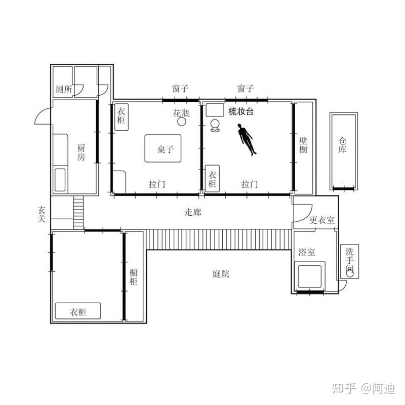
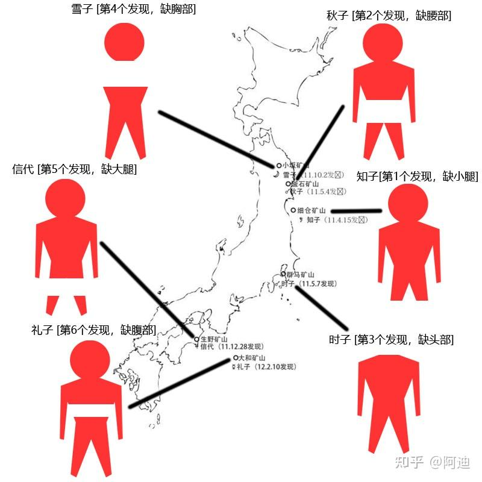
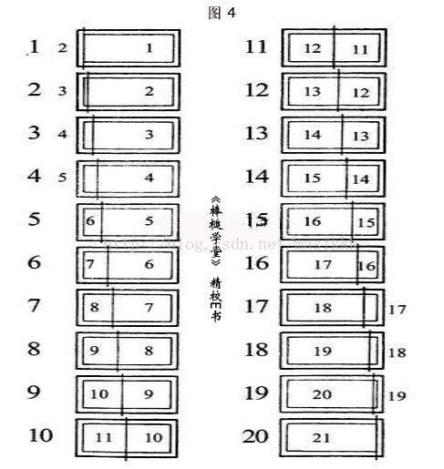
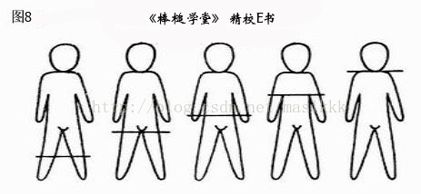

> *“发挥才智，则锋芒毕露；凭借感情，则流于世俗；坚持己见，则多方掣肘。总之，人世难居。”*
---

- 最优秀的诡计之一，唯一的缺点就是作者写的太水了，篇幅过长，探案过程也不知所云，好像啥也没干就探出来了，当然在这诡计面前都不是问题，这个诡计优秀到了这本小说值得所有人一看。
- 人物介绍：
	- 梅泽平吉：画家
	- 梅泽吉男：梅泽平吉的弟弟
	- 信代：吉男的女儿
	- 礼子：吉男的女儿
	- 多惠：平吉的前妻
	- 时子：平吉和多惠的女儿
	- 昌子：平吉现任妻子
	- 雪子：平吉和昌子的女儿
	- 一枝、秋子、知子：昌子和其前任的女儿
	 
- 手记的内容：
	- 手记内容可以简单概括为：
		我认为人的身体可以分为六个部分，分别为头部、胸部、腹部、腰部、大腿、小腿，分别对应白羊、巨蟹、处女、天蝎、射手、水瓶六个星座。如果某人是白羊座，说明他对应的身体部位——头部非常完美，如果某人是巨蟹座，说明他对应的身体部位——胸部非常完美。那么，如果将白羊座的头部、巨蟹座的胸部、处女座的腹部、天蝎座的腰部、射手座的大腿、水瓶座的小腿拼接在一起，就能创造出全身都非常完美的人——**阿索德**。幸运的是，我的6个女儿（和侄女）刚好符合条件，因此，根据星座的不同，我准备分别用铁、银、水银、铁、锡、铅杀死她们，然后将她们分尸，取得时子的头部、雪子的胸部、礼子的腹部、秋子的腰部、信代的大腿、知子的小腿创造出完美女性——阿索德。分尸之后，同样根据星座的不同，将6具分别被取走某个部位的躯体埋在日本各地。
- 总共有三个案件：
	1. 梅泽平男案件：
		- 时子为平男送早饭时，发现房门紧锁，走到窗户边观看时发现平男已死在房间中，于是回去找姐妹们一起合力撞开了门
			
		 现场如图，平男后脑勺有被钝器殴打的痕迹，并且经检测平男死前吃了安眠药，因此警方怀疑是几个女孩串通好了，在平男吃下安眠药睡觉后，用四根绳子牵动床使其悬空，然后将其砸死，这也能解释为什么床的位置是歪的
		 但是，洗手台到床边的足迹为男鞋，床边到通道那一大串脚印既有男鞋又有女鞋，警方估计，女鞋应该为模特的脚印，男鞋暂时无法理解是为什么
	 2. 一枝案件：
		 - 平吉被杀近一个月后，一枝被杀。一枝的住所比较偏僻，因此直到第二天晚上8点左右才被邻居发现。屋内很乱，衣柜被翻得乱七八糟，抽屉里的现金和值钱的东西都不见了，似乎是一起普通的入室抢劫案。凶器就是放在隔壁的花瓶。尸体体内留有男人的精液，因此凶手为男性。从尸检结果来看，应该是死后被强暴的。
		  
	3. 阿索德案件
		- 一枝被杀后没多久，知子、秋子、雪子、时子、礼子、信代6人集体失踪。随后依次在日本各地发现6人尸体，且每具尸体均缺少一个部位，似乎正对应了梅泽平吉的手记中的内容。
		 
- 解密环节：
	- 凶手为时子，动机为：时子作为昌子的女儿，在平吉家里不免收到欺凌，同时昌子只能一个人独自生活，时子每次回去探望昌子，只能看见昌子孤独的背影，昌子的愿望不过只是想要开一家小卖部独自生活，时子想要复仇的心情与日俱增。
	1. 第一起案件：
		- 平吉画画的模特正是时子，正是由于这层关系，平吉才放心当着时子的面吃下安眠药。原本时子已经打起了退堂鼓，但是她发现，如果再拖延一会，平吉的画作就足以被辨别出来是时子，因此她使用某种钝器砸死了平吉，同时留下了他伪造的手记，使用事先埋伏在床边的绳索把门闩拴上，但此时挂锁还没锁上。然后她先穿女鞋回到后门，再踮着脚回到窗边，最后穿上男鞋回到后门，掩盖了踮着脚的脚印。离开后，时子一直在雪天躲到了第二日。
		- 第二日，时子借口送早餐，来到窗边，把男鞋丢进去，随后叫姐妹把门撞开后，趁乱把挂锁锁上，由于人很多，鞋子丢进去再杂乱也无所谓。由此形成了一个完美的密室。也是此时，时子“发现”了一本手记，也就是本文开头的那本手记。
	 2. 第二起案件：
		 - 时子来到一枝家中，偷袭了一枝，把她的的尸体放在原地没有动过。然后，她假装成一枝，诱惑了每日路过的警官竹越，与其发生关系，然后取出精液，放入一枝的尸体内部，构成了被强暴的假象。尸体被发现后，竹越不明真相，惶惶不可终日，这件事成为了后来竹越被要挟的把柄。
	 3. 第三起案件：
		 - 时子等人出游，时子找机会将其余5人毒杀，并藏尸于一枝住处。文次郎听闻一枝被杀后，不明真相，担心受牵连。时子便以此要挟文次郎，让其将尸体按要求分别埋在日本各地。
		 - 关于如何伪造出六具尸体：
			 - 
			 - 
			 - 书中以钞票骗局为例，大致手法为：把第一张钞票的1/20替换第二张钞票的2/20，以此类推，这样每张钞票都只有19/20，除了第一张与最后一张钞票的左右两侧有缺失以外，其余钞票用不透明胶带粘在一起后，均无明显痕迹。
			 - 尸体同理，将第一具尸体的脚部替换第二具尸体的大腿以下部分，这样就会显得第二具缺失了大腿部分，以此类推，每具尸体分别缺失了，头部，脚部，腿部，裆部，腹部，胸部。最后，因为那本手记，大部分人都认为缺失的部分被拿去做“阿索德”了，这就是所谓的“不透明胶带”，诡计就此打成。
			 - 找出凶手的方式也很简单，没头的那具尸体就是了。

[[../../总览/作者/岛田庄司|岛田庄司]]
