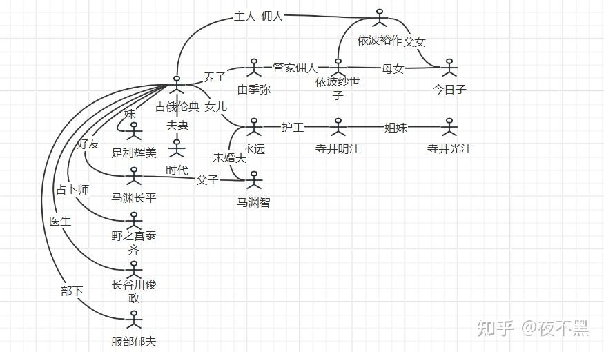

《钟表馆事件》是绫辻行人“馆系列”中公认的巅峰之作，其核心诡计围绕时间差与建筑诡计展开，也是本人读的第一部“馆系列”作品，但是在本人读来，这部作品的漏洞实在不少，诡计部分观感一般，精彩之处是故事情节上的反转，也是情节上的优秀让我给了8分
 - **人物说明**：
	【古俄伦典】：钟表馆的前主人，古俄钟表公司社长，为女儿建造了这座钟表馆，几十年前死于意外。
	【古俄永远】：伦典的女儿，天生绝症，被预测和她母亲一样活不过20岁，在某一天用剪刀自杀。
	【古峨由季弥】：古俄伦典堂兄的儿子，现为钟表馆名义上的继承者，精神有问题
	【中村青司】：建筑师，他设计了这座精妙绝伦的钟表馆。
	【鹿谷门实】：推理作家，在文中代表作者化身的解密角色。
	【依波纱世子】：古俄家佣人，照顾现任钟表馆主人由季弥少爷，因为得知自己女儿当年死亡真相，产生了报复想法，诱导并策划了钟表馆杀人事件，最后在钟表馆设计的16岁时间到后自我毁灭的机关中身亡。
	【光明寺美琴】：本名寺井光江，是很多年前照顾永远小姐的女仆寺井明江的妹妹，作为降灵师参与此次活动，为了调查姐姐死因，却被凶手算计死亡。
	【江南孝明】：“稀谭社”编辑，活动参与者和策划者，因为凶手需要留下一个证人揭开作为其不在场证明的证据，而幸免于难。
	【福西凉太】：W大学超现象研究会成员，年幼时遇见永远的小孩之一，因为亲人丧礼没有及时参与降灵活动，后随鹿谷门实进入了新馆，幸免于难。
	
 - **故事背景**：
	- 钟表馆：
		古俄伦典所修，原本只有旧馆，其中全是钟，还有一座钟塔，不过从来不会响，永远死后，在此后短短数年间，古峨家接连又有六位相关人士离世：自责的护士寺井明江上吊自杀、佣人伊波纱世子的女儿今日子在森林中感染破伤风夭折、医生长谷川俊政死于火灾、部下服部郁夫死于车祸……此后，沉默的钟塔下，传说出现了一位美丽少女的幽灵，在森林中徘徊。之后新修了一个新馆，供由季弥及管家居住。
- **情节**：
	1. **通灵**：
		1990年，以超自然现象为主题的杂志《CHAOS》决定组织一场为期三天的通灵会，地点就选在这座传说中的“幽灵馆”——钟表馆旧馆。主办方为《CHAOS》副主编小早川茂郎、新人编辑江南孝明、摄影师内海笃志，参与者有W大学超常现象研究会的六名成员——瓜生民佐男（会长）、渡边凉介、福西凉太、樫早纪子、河原崎润一、新见梢，灵媒师光明寺美琴。
		
		

[[../../总览/作者/绫辻行人|绫辻行人]]