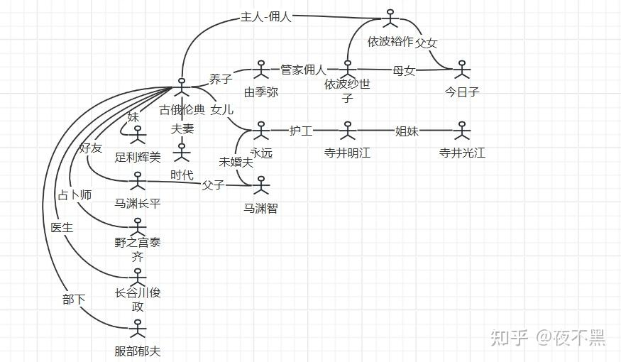
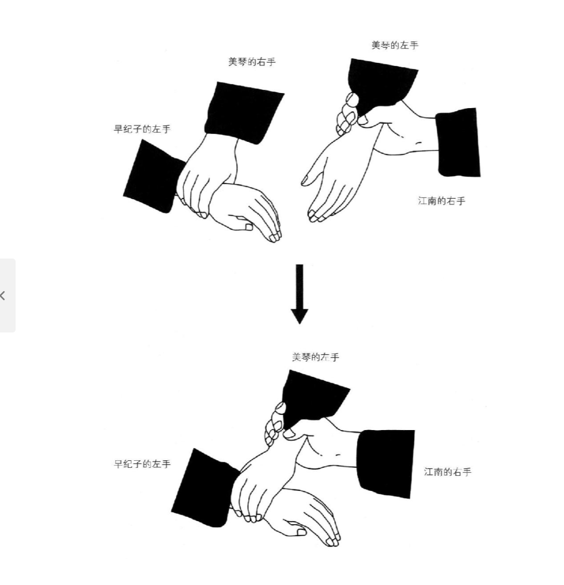

《钟表馆事件》是绫辻行人“馆系列”中公认的巅峰之作，其核心诡计围绕时间差与建筑诡计展开，也是本人读的第一部“馆系列”作品，但是在本人读来，这部作品的漏洞实在不少，诡计部分观感一般，精彩之处是故事情节上的反转，也是情节上的优秀让我给了8分
 - **人物说明**：
	【古俄伦典】：钟表馆的前主人，古俄钟表公司社长，为女儿建造了这座钟表馆，几十年前死于意外。
	【古俄永远】：伦典的女儿，天生绝症，被预测和她母亲一样活不过20岁，在某一天用剪刀自杀。
	【古峨由季弥】：古俄伦典堂兄的儿子，现为钟表馆名义上的继承者，精神有问题
	【中村青司】：建筑师，他设计了这座精妙绝伦的钟表馆。
	【鹿谷门实】：推理作家，在文中代表作者化身的解密角色。
	【依波纱世子】：古俄家佣人，照顾现任钟表馆主人由季弥少爷，因为得知自己女儿当年死亡真相，产生了报复想法，诱导并策划了钟表馆杀人事件，最后在钟表馆设计的16岁时间到后自我毁灭的机关中身亡。
	【光明寺美琴】：本名寺井光江，是很多年前照顾永远小姐的女仆寺井明江的妹妹，作为降灵师参与此次活动，为了调查姐姐死因，却被凶手算计死亡。
	【江南孝明】：“稀谭社”编辑，活动参与者和策划者，因为凶手需要留下一个证人揭开作为其不在场证明的证据，而幸免于难。
	【福西凉太】：W大学超现象研究会成员，年幼时遇见永远的小孩之一，因为亲人丧礼没有及时参与降灵活动，后随鹿谷门实进入了新馆，幸免于难。
	
 - **故事背景**：
	- 钟表馆：
		古俄伦典所修，原本只有旧馆，其中全是钟，还有一座钟塔，不过从来不会响，永远死后，在此后短短数年间，古峨家接连又有六位相关人士离世：自责的护士寺井明江上吊自杀、佣人伊波纱世子的女儿今日子在森林中感染破伤风夭折、医生长谷川俊政死于火灾、部下服部郁夫死于车祸……此后，沉默的钟塔下，传说出现了一位美丽少女的幽灵，在森林中徘徊。之后新修了一个新馆，供由季弥及管家居住。
- **情节**：
	1. **通灵**：
		1990年，以超自然现象为主题的杂志《CHAOS》决定组织一场为期三天的通灵会，地点就选在这座传说中的“幽灵馆”——钟表馆旧馆。主办方为《CHAOS》副主编小早川茂郎、新人编辑江南孝明、摄影师内海笃志，参与者有W大学超常现象研究会的六名成员——瓜生民佐男（会长）、渡边凉介、福西凉太、樫早纪子、河原崎润一、新见梢，灵媒师光明寺美琴。福西凉太由于迟到未能进入钟表馆，同时与鹿谷门实偶遇，一同在场外游荡。
		
		在进入旧馆前，纱世子以“保持磁场纯净”、“避免干扰灵异现象”为由，收缴了所有人的手表、相机、手机等一切能显示真实时间的物品。但是江南孝明实际已经偷偷拿走了一个表，作为自己时间参照的标准。
		
		通灵时，所有人围成一个圈，左右手互相拉着，而在光明寺的行动下，仿佛永远真的收到了召唤似得，通过一声声咚咚的声音回答着光明寺的问题。
		（由于这个诡计不重要，故在此解释）
		
		如图，光明寺在仪式进行时假装被附身了，开始身体左右摇晃，然后以极快的速度，将右手松开然后用左手抓住早纪子，由于提前和早纪子传统好了，并且整个流程都处于黑暗状态，所以没有人发现。关于蜡烛突然熄灭，只需要把蜡烛的烛芯剪掉一半就好了。
	2. **灭口**
		***外界时间：7月31日 01:20***  
		***旧馆时间：7月31日 03:30***
		
		当晚，江南孝明因药物作用醒来，偶然看到美琴的身影，并尾随她穿过长走廊，进入本应上锁的“钟摆间”。他在门外听到美琴与人说话，紧接着是**硬物撞击的闷响**和**有人倒地的声音**。江南呼唤后无人应答，因头脑昏沉，最终以为是一场梦。第二日晨，大家发现找不到美琴的踪迹，同时发现钟摆间内流出来大量血液，室内钟表也被故意砸坏，表针停在**3:30左右**，以此固定“案发时间”。
	3. **复仇**
		***外界时间：约18:50 - 19:00***  
		***旧馆时间：8月1日 00:00前后***
		
		**早纪子**在熟睡中，被潜入房间的凶手用**青铜座钟**砸碎面部，当场死亡，毫无反抗迹象。随后，凶手来到大厅。**渡边凉介**正趴在桌上打盹，他察觉到有人从早纪子房间出来，但并未警惕。当他上前搭话时，凶手转身，露出一张**戴着惨白面具的脸**。渡边惊倒在地，随即被凶手用沉重的座钟多次猛击后脑致死。杀害两人后，凶手故意去敲**新见梢**的房门。小梢开门后，看到一个穿着“灵衣”、戴着诡异面具的黑影，胸前衣物**被鲜血浸湿**。凶手一言不发，转身向东侧走廊跑去，消失在黑暗中。
		
		与此同时，仅剩的几人意识到，平时喝的水中含有药物影响，这才使得他们极度嗜睡，导致了几人对时间的误判。
	4. **销毁**
		***外界时间：约07:10***  
		***旧馆时间：8月1日 12:30***
		
		内海因极度恐惧，将自己反锁在Ⅸ号室，并用陈列柜堵死房门。中午，江南和瓜生在大厅突然听到内海**凄厉的惨叫**，两人立刻冲向Ⅸ号室。江南在砸开房门上的玻璃前，透过磨砂玻璃**看到了室内有人影晃动**。当他们终于破开门后，发现内海被砸死，但**室内空无一人**。其实房间里面那个大钟是可以挪动的，凶手挪开大钟之后直接进入房间，而内海无法反抗，惨遭杀害。
		
		凶手意识到，内海的相机不仅能拍下照片，其机身内置的时钟会记录下**真实的拍摄日期和时间**，这会让时间诡计瞬间暴露。因此，这是计划外的、但必须执行的一次灭口。凶手扯出所有胶卷曝光，并砸毁了两台相机，取走了电池。
		
		***外界时间：约07:30***  
		***旧馆时间：8月1日 13:00***
		
		河原崎为安全起见，选择**倚靠在房门内侧**睡觉，以为这样就能防止有人闯入。然而，凶手再次通过暗门，直接从他身后的墙壁中悄悄进入。她先用**圆筒形座钟**猛击河原崎的头部。河原崎惊醒后奋起反抗，一度将凶手压在身下，并扯下了**凶手的白色面具**。看到真容的瞬间，他震惊得停下了动作，问：“**是你……为什么……**” 就在此时，凶手抓起地上摔坏的**钟表指针**，刺入他的后颈。河原崎当场死亡。

		尸体被发现时走廊的双圆钟上，被凶手用指针钉上字条：“**是你们杀死的**”。
	5. **清洗**
		***外界时间：约17:25***  
		***旧馆时间：8月2日 01:00***
		瓜生为寻找失踪的小梢，独自进入“钟摆间”。他坐倒在书桌前的椅子上，打开音乐盒，看着**永远与由季弥的合影**，陷入沉思。此时，凶手突然从卧室冲出，用**拨火棍**（而非钟表，因此时已无需再掩饰毁坏钟表的目的）从正面猛击其头部。瓜生头骨碎裂，当场身亡。瓜生紧握的照片：**永远和由季弥的合影**。这成为后来江南和鹿谷推理时的重要转折点。
		***外界时间：约17:30***  
		***旧馆时间：8月2日 01:00+***
		江南随后赶来，发现了瓜生的尸体和其手中的照片。就在他查看照片时，躲在身后的凶手用**拨火棍**击中了他的后颈。江南昏迷过去。但是并未死亡。凶手将昏迷的江南拖进**盥洗室**，从外面用钢琴等重物堵死房门。她砸碎并破坏了盥洗室内的所有灯具，让江南在**绝对的黑暗中**醒来，以彻底扰乱他的时间感，确保他无法察觉时间异常。
		***外界时间：约18:30***  
		***旧馆时间：8月2日 02:30***
		精神已彻底崩溃的小早川，为了逃出去，用墩布戳破了一扇天窗。随后，他钻到圆桌下检查钟的驱动装置，意外发现了**纱世子安装的窃听器**。正当他拿着窃听器疑惑时，纱世子从背后袭来，用**拨火棍**多次猛击其后腰和头部，将其活活打死。

		留下的线索只有被**打破的天窗**和桌子下发现的**窃听装置**。  
		***外界时间：约18:00-19:00之间***  
		***旧馆时间：8月2日 05:00-06:00左右***
		小梢因恐惧和口渴离开房间，意外发现了“钟摆间”大壁橱内**敞开的密道入口**。她以为是逃生之路，一路跑到了骨灰堂。当她推开骨灰堂大门，眼前不是黑夜，而是**暴风雨中的白昼**。就在她为这时间错乱而震惊时，紧随其后的纱世子将她掐死。
	6. **发现**
		- 在鹿谷门实与福西凉太的搜查过程中，福西凉太透露：瓜生，河源崎，他，以及樫早纪子四人，十年前曾于此游玩，瓜生与他在地上挖了一个洞，试图害一下河源崎，但洞始终没派上用场四人就离开了。在游玩过程中，四人曾与一个小孩交流，他们认为那就是永远。福西凉太始终怀有愧疚之心，认为或许是自己害死了永远。同时，他们在馆内寻找到古峨伦典的日记中也写到：**瓜生民佐男、河原崎润一、渡边凉太（福西旧姓）、樫早纪子**，以及“是他们杀死的”等充满恨意的话,纱世子也说永远是掉到坑里然后死的，这似乎也印证了他的回忆。    
		
		- 8月2日凌晨，福西回到自己房间后无法入睡。他反复回忆10年前的细节，推算出一九七九年七月和八月的日历后，发现一个致命的矛盾——纱世子说永远是**7月29日**掉进陷阱，而自己记忆中遇到永远的那天是**7月的最后一个星期天**，两者竟是同一天。这意味着，永远不可能在“同一天的下午”分两次去森林。福西开始怀疑纱世子在撒谎。意识到这一点后，他前往寻找由纪弥，但是被凶手推下了阳台，身受重伤并昏迷。

		- 8月2日早上，鹿谷门实起来后发现福西凉太不见了，随后与纱世子一同前往搜寻，先是发现了渡边和早纪子的尸体，还发现了**江南遗落的笔记本**。在调查钟摆间时，鹿谷发现盥洗室的门被堵住了，随后发现了奄奄一息的江南，此时江南已经被困了约20小时。随后，鹿谷沿着盥洗室的密道前往了骨灰堂，在其中发现了小梢，美琴，占卜师的尸体。离开骨灰堂后，众人在草地上发现了昏迷的福西凉太。随后，由纪弥出现在四楼的机械室，大喊了一声：“姐姐！”，随后一跃而下，自杀了。

	7. **十年前的真相**
		- **古峨伦典**的妻子名为**古峨时代**，二人十分恩爱。然而，他们家族的占卜师给出了一个预言：时代将会在28岁生日后死去。预言应验了，时代的生命终止在了28岁。二人拥有孩子**古峨由纪弥**和**古峨永远**，由纪弥将永远视做偶像，而永远的梦想是：想要和她的妈妈一样做一个美丽的新娘。为此，时代将她结婚时的婚纱交给了永远。但是，占卜师再一次给出了预言：永远将于16岁生日后死去。这下伦典慌了神，随后命令建造了钟表馆，在这个钟表馆内的钟表跑速比外界快，这样永远就可以提前成年，满足心愿了。被早纪子戳破的那个天窗实际上是个假天窗，用来掩盖室内外光线不一致的情况。

		- 永远就这样愉快的生活了16年，直到她在某次出门时遇到了幼年的四人。在与之短暂交流后，永远意识到她被骗了。这使得她悲痛不已，随后回家用剪刀剪破了婚纱，随后穿上婚纱自杀了。
		
		- 关于那个大坑，那个大坑实际上害死的人不是永远，而是纱世子的女儿**今日子**。今日子掉进了那个坑里无能为力，由纪弥发现了落入坑中的今日子，但他认为：这样她就可以和姐姐一样在黑暗中了，于是选择冷眼旁观，这也是纱世子的作案动机。

	8. **终局**
		***女神被缚于沉默的监牢***
		***一九九二年八月五日　处刑当天***  
		***时间终结　七色光芒照进圣堂***
		***在震天动地的呼喊声中　你们听到了吧***  
		***沉默女神那　只吟唱过一次的歌声***
		***那是美妙动人的临终旋律***  
		***那是哀叹之歌　那是祈祷之歌***  
		***与那罪孽深重的野兽骸骨一起***  
		***献予我等墓碑之前　以慰我灵***

		这是古峨伦典所创作的诗，即刻应验。鹿谷门实戳穿了纱世子的谎言，众人前往钟表馆，正午十二点，在阳光的照射下，钟表馆的墙壁发出了诡异的光芒，三口大钟发出铃声，钟塔倒塌，时钟的指针掉落下来贯穿了纱世子，这个指针是纱世子之前自己取下来放在机械室的。整个钟表馆随后归于尘土。
		
		**沉默的女神**：钟塔上九年来从未敲响过的三口大钟。
		**束缚于沉默的监牢**：钟舌未与机械连动，也没有拉绳，无法被正常敲响。
		**一九九二年八月五日**：并非真正的1992年，而是“旧馆”内虚假时间走过15年后，古峨永远将要迎来的“28岁生日”。
		**时间终结**：永远的出生时刻——正午12点。
		**七色光芒照进圣堂**：正午时分，钟塔大厅墙壁上嵌着的彩色玻璃间沙子流尽，外界七彩光芒透过玻璃照入塔内。
		**震天动地的呼喊声**：钟塔底部机关启动后，塔身开始崩塌时发出的地动巨响。
		**只吟唱一次的歌声**：三口大钟只有在钟塔倒塌、整个建筑倾覆的瞬间，才会在晃动中第一次也是最后一次鸣响。
		**罪孽深重的野兽骸骨**：指代古峨伦典心目中“害死”女儿的那些人——包括预言了死期的占卜师野之宫泰齐，以及养子古峨由季弥。
		**献予我等墓碑之前**：钟塔的倒塌方向正好是骨灰堂的方向——正北方，日晷盘上表示“十二点”的位置，即永远的出生时刻方向。
- 整个故事前半段看起来的观感实际上很一般，明摆着告诉你凶手是密道来的，也没写出啥压迫感，读起来就很乏味。时间诡计也很好猜。后半段的解密部分观感就好了很多，不仅写出了这个时间诡计的背景故事，还一直误导读者坑里摔死的就是永远，最后的预言应验也很震撼。   
	总的读起来，作为一个新
[[../../总览/作者/绫辻行人|绫辻行人]]