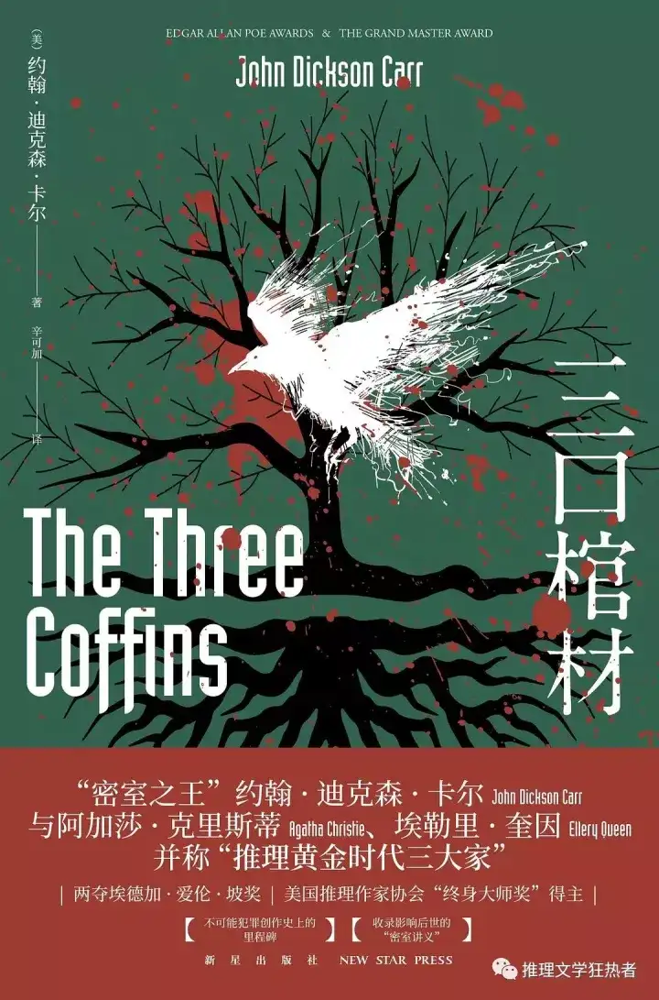

*“我又平添一桩罪孽，哈德利，”他说，“我又一次猜对了真相。”*

- 同样是一部神作，所有的线索都摆在了读者面前，真正阻止读者探索真相的似乎只有读者的自作聪明，诡计的设计更是无与伦比，读起来也没有网上说的那种翻译不好的观感
- 梗概：
	- 第一位死者：葛里莫（实际第二位）
	- 第二位死者：弗雷（实际第一位）
	- 密室类型
		- “内出血密室”。所谓“内出血密室”，即死者在进入密室之前并未失去行动能力。版权归作者所有，任何形式转载请联系作者。至于凶手则从始至终没有进入过密室，自然不会在密室内留下什么蛛丝马迹。本案中的两名死者都死在这样的密室之中。
	- 事件顺序：
		- 1.葛里莫与弗雷是兄弟关系，还有一位兄弟“亨利”，三人被活埋，葛里莫被德瑞曼救出，但没有去救剩下二人，但弗雷实际上也活了下来
		- 2.葛里莫拥有了幸福的生活，然而在某一天遭到弗雷发现，弗雷进行敲诈。此时，弗雷对其他人进行暗示，暗示其他人葛里莫有不可告人的秘密，并且自己如果死了，与葛里莫一定有关
		- 3.葛里莫的原计划：
			- 1.假意与弗雷谈判，此时用枪从正面杀死弗雷，提前写好弗雷的遗书，营造出弗雷自杀的假象
			- 2.伪装成弗雷，造访自己家，打开自己卧室时，与自己提前放置的镜子形成两个人的假象，从而制造自己一直在家的证据，形成不在场证明
			- 3.对自己开枪，假装与不存在的弗雷进行打斗，并且其在开枪后以某种方式离开
		- 4.实际上发生的：
			- 1.未能做到正面打死弗雷，甚至还从背面打了他一枪，这不可能是自杀的伤痕，枪也被弗雷拿走
			- 2.弗雷并没有立刻死亡，甚至还离开了屋子，走到大街上，在葛里莫准备上千补刀时及时发现，打了葛里莫一枪，造成重伤，但是自己也喷血身亡了
			- 3.弗雷死时被二人目击，虽没发现凶手，但是注意到旁边珠宝店的时间为十点二十五分，实际上这个钟走快了四十分钟，实际时间约为九点四十左右
			- 4.葛里莫深陷绝望，但是他想到自己还有不在场证明，于是决定回到家中，执行接下来的计划，可是雪一直在下，“弗雷”不可能离开不留下脚印，不过这些他已经来不及考虑了，他在把那个极重的镜子藏起来时，伤口破裂，鲜血迸发，命不久矣
		- 5.遗言：
			- 葛里莫在死前所说的遗言把整个案件推向了新的谜题：
				- 第一段是他在濒死时说出的一串看似语无伦次的单词：

