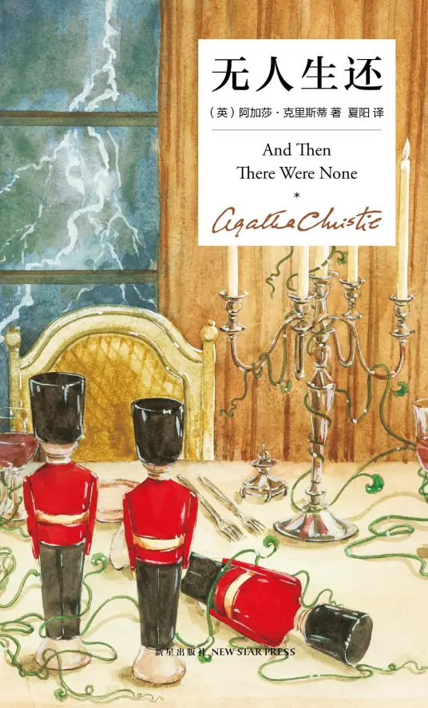

*生既是死，无时无刻。*

- 暴风雪山庄的代表之作，与其他同类型作品不同的是，这部作品没有侦探这个角色，结局出现相当让人惊喜，人物的塑造也是十分生动，让人着迷
- 梗概：
	- 地点：
		- 士兵岛：传言是一个叫欧文的财主买下了这个岛。对这个神秘的小岛，报纸和舆论还炒的沸沸扬扬。它离岸很远，需要做船才能到达。
	歌谣：
		- 十个小兵人，外出去吃饭；
		- 一个被呛死，还剩九个人。
		- 九个小兵人，熬夜熬得深；
		- 一个睡过头，还剩八个人。
		- 八个小兵人，动身去德文；
		- 一个要留下，还剩七个人。
		- 七个小兵人，一起去砍柴；
		- 一个砍自己，还剩六个人。
		- 六个小兵人，无聊玩蜂箱；
		- 一个被蛰死，还剩五个人。
		- 五个小兵人，喜欢学法律；
		- 一个当法官，还剩四个人。
		- 四个小兵人，下海去逞能；
		- 一个葬鱼腹，还剩三个人。
		- 三个小兵人，进了动物园；
		- 一个遭熊袭，还剩两个人。
		- 两个小兵人，外出晒太阳；
		- 一个被晒焦，还剩一个人。
		- 这个小兵人，孤单又影只；
		- 投缳上了吊，一个也没剩。
	- 人物简介：
		- 法官：退休老法官沃格雷夫，收到老友来信，受邀请去岛上赴宴。
		- 女教师：克莱索恩，年轻的女老师，收到来信聘请到岛上做欧文先生的暑假兼职秘书。
		- 队长：退伍军人，隆巴德，收到来信重金邀请去岛上，帮忙处理棘手的场合。
		- 老女人：布伦特，65岁，愤世嫉俗的信教徒。被邀请到岛上免费度过这个暑假。
		- 将军：麦克阿瑟，退伍的老将军，部队的老同事来信邀请岛上叙旧。
		- 医生：阿姆斯特朗，外科医生，受邀到岛上为欧文先生看病。
		- 帅哥：安东尼·马斯顿，纨绔子弟，喜好飙车与美女，受欧文邀请到岛上去参加派对。
		- 侦探：退休的警官，布洛尔，受欧文雇佣，冒充军人去岛上赴宴，并监视其他人。
		- 男管家和他的妻子：罗杰斯夫妇，提前被欧文通过信件聘用，到岛上来准备几个人的宴会。他也没有见过欧文先生。
	- 事件：
		1. 质控：
			八个人上岛，加上两个管家，岛上共十人，晚饭时间，管家已经准好好了美酒佳肴。餐桌上摆了10个印第安小瓷人。突然，传来了一个声音：“女士们、先生们，**你们被控告犯有下列罪行**：老女人对泰勒致死负全责；警官布洛尔害死了兰道；女教师你谋害了一个叫汉密尔顿的小男孩；隆巴德犯有东非部落21名男人死亡的罪行；法官操纵陪审团，谋杀了被告塞顿；将军谋害了你妻子的情人。马斯顿驾驶没有拍照的汽车，压死了两个小孩约翰和露西；管家夫妇害死了你们照顾的布雷迪老人。” 10个人全部被指控犯有杀人的罪行。法官主持了局面，大家冷静下来，发现大家都是被骗到岛上的
		2. 罪行：
			1. 女教师有着对爱情的执着，但对金钱更加渴望，为了让自己的爱人雨果得到遗产，她故意让原本的遗产获得者，体质虚弱的西里尔独自去游泳，并在其溺水的时候装作是没能赶上的样子，眼看着其溺死，但雨果似乎察觉了此事并与她分手，成为了她的心痛。
			
			2. 队长隆巴德性格接近于冷血，曾经当他与自己的部下在森林中迷路时，只与一两人一起带走了全部粮食，留下剩余的二十一个东非部落土人活活饿死，并声称这是自己求生本能作祟，他对自己的所作所为毫不遮掩，也毫无愧疚。  
			
			3. 身为修女的布伦特无法容忍一切品德的败坏，但其实嫉妒心强烈，因为觉得自己的佣人比阿特丽斯泰勒放荡不羁，不讲礼数而在言行上表现出对其的百般不满，并将其赶出家门，直接导致了比阿特丽斯泰勒的自杀。
			
			4. 将军麦克阿瑟为了报复与自己妻子偷情的部下阿瑟里奇蒙，仍派他去执行了毫无生还可能的任务并成功害死了他。自己一生为担心此事暴露而困扰万分。  
		
			5. 医生阿姆斯特朗，在一次为病人开刀做手术的时候喝过了酒，导致自己处于喝醉的状态下进行了手术，手的发颤直接导致了手术的失败，对外他宣称了是手术意外，然而实际全部责任都在他自己身上。 
			
			6. 法官在审理塞顿的案件时，坚持认为被告有罪，于是操纵陪审团，最终判处了被告死刑。  
			
			7. 纨绔子弟的马斯顿因为车速过快直接撞死了两名儿童约翰和露西库姆斯，并对此事不屑一顾，认为那只是自己走了霉运，全然不觉得自己对这起事故有何责任。  

			8. 身为侦探的布洛尔曾经是个警官，在伦敦商业银行抢劫案时作为证人指证了一名叫兰道的男子为凶犯，立了大功，而兰道在关押期间由于身体虚弱一命呜呼，而实际上兰道根本是清白的，布洛尔在收取了钱财之后，为真正的歹徒作伪证，陷害了一条无辜的生命。

			9. 管家罗杰斯夫妇照料过布雷迪小姐，在一个大风的夜晚，布雷迪小姐突然发病，由于大夫未能及时赶来导致了小姐病逝，罗杰斯夫妇从中获得了一笔遗产，而事实上却很可能是由于罗杰斯夫妇停止了让布雷迪小姐吸入治病的特效药亚硝酸戊酯而导致其病发身亡的。

			- 他们虽然都犯有罪行，可是法律是拿他们没有办法的，**因为这些罪行不可能找到证据指证他们**。
		3. 噎死一个：帅哥马斯顿，喝酒酒中含有氰化物，噎死了，第一个小瓷人消失了，罗杰斯太太吓晕了。
		4. 睡死一个：罗杰斯太太在睡梦中死去了，没有外伤，医生阿姆斯特朗，侦探布洛尔，军人隆巴顿联合在了一起，隆巴顿告诉他人他带着手枪，桌子上的小瓷人还剩下8个了。
		5. 砸死一个：将军麦克阿瑟被钝器击打而亡，小瓷人只剩7个了，人人自危的局面开始了。
		6. 劈死一个：另一日早晨，小瓷人只剩6个了，大家发现罗杰斯被人用斧头从后脑勺劈死。
		7. 蛰死一个：大家发现老女人十分冷静，一致认为老女人布伦特有问题，前往她的房间，却发现布伦特已经死在了凳子上，颈部有针管痕迹，凶手还放了只大胡峰以便让死亡和歌曲一致，针管是医生的，小瓷人只剩5个了。
		8. 射死一个：大家一致同意把所有人的药品与武器锁在厨房，钥匙交给了军人隆巴顿和侦探布洛尔，布洛尔的手枪却消失了，大家都找不到。当大家一起吃饭时，大家一致同意，每次只准一个人出房间，突然，蜡烛熄灭，一只冰冷的手触碰到了女教师克莱索恩的脖子，当大家发现其实是海藻时，大家还发现：法官不见了。法官被发现时，身处客厅角落，披着紫色的窗帘，带着假发，被枪杀了。小瓷人只剩4个了。
		9. 你死我活：第二日早，伴随一声巨响，布洛尔被发现被一个石头砸中头部身亡，隆巴顿和女教师都认为是医生杀得，前往找医生。悬崖下，他们发现医生的尸体被冲了上来。当隆巴顿正在拉尸体时，女教师偷走了隆巴顿的枪，他们都彼此怀疑是对方干的，当隆巴顿暴起时，女教师一枪打死了他。伴随着深深的愧疚与对自己以前罪行的忏悔，她回到了自己的房间，在房间里，一根绳套掉落下来，一把椅子摆在绳套下面，伴随着幻幻想与愧疚，她把脖子套上了绳套，踢开了凳子，最后的3个小瓷人也碎了。
	- 手法：凶手为法官，他使用氰化物毒死了第一人，用过量安眠药毒死了第二人，用毒药毒死了第三人，第四人第五人都是趁乱杀死的，然后偷走了隆巴顿的枪，藏在了一堆没吃过的罐头里面，说服了医生，伪装成了自己死亡，然后就可以偷偷行动。后面与医生碰头时，将其退下悬崖

[阿加莎克里斯蒂](../../总览/作者/阿加莎克里斯蒂.md)