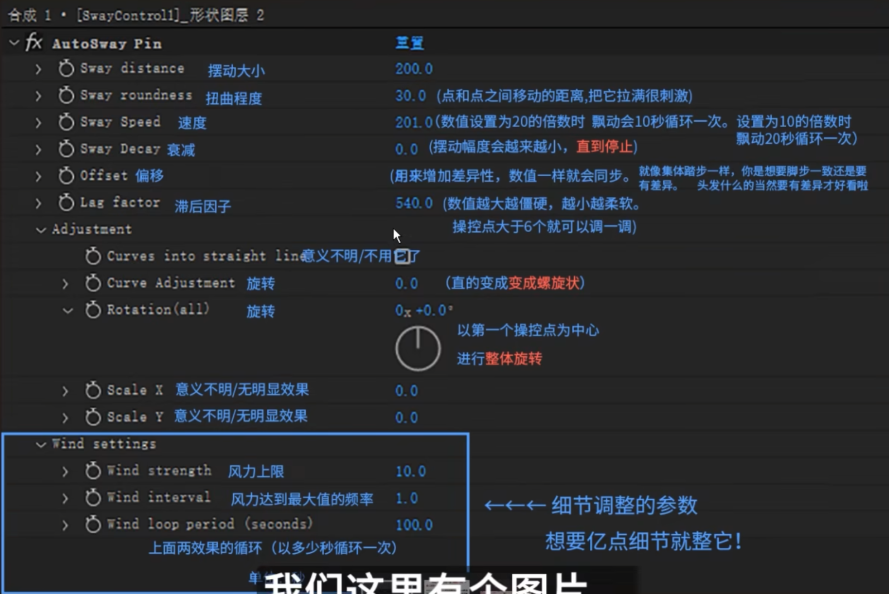
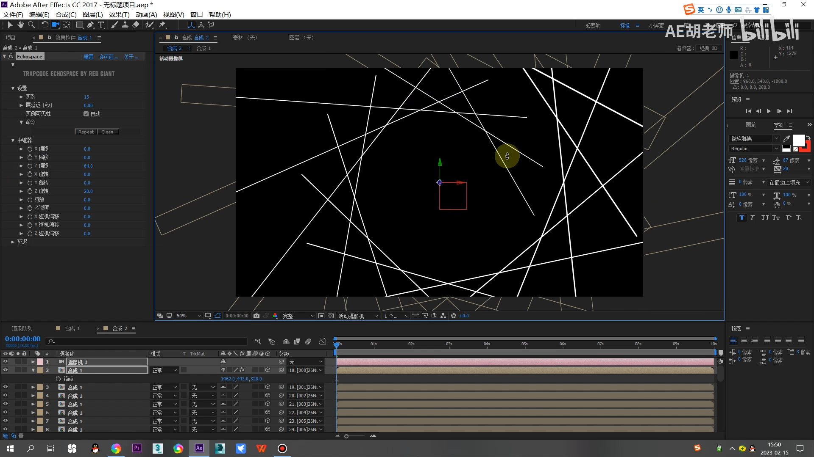

## - 效果
- displacement map 置换图
- 涂写（涂鸦风）
- 打字机（字体一个一个出现）
- cc repetile重复平铺
- offset 偏移（可以和原图层混合）
- light leak 漏光
- looks中
	- Subject
		- Curves 调阴影
		- Pop 调边缘
	- Matte
		- Diffusion 有一种朦胧的感觉
	- Lens
		- Chromatic 镜头失真（rgb分离效果）
		- Edge softness 边缘模糊
	- Camera
		- Renoiser 有一点噪点的感觉，更有质感
		- Exposure 曝光
	- Post
		- Mojo 调对比度
- autosway中
	-

- echo 残影
- rgb分离效果
	- shift channle 转换通道
	- optics compensation 光学补偿
- 线条空间
	- 其他合成拉一根线然后中继器echospace
	- 
- offset path 偏移路径：amount产生空隙，copies产生类似波纹效果
- trim path 修剪路径
- amount 数量：类似波纹效果
## - 表达式
- wiggle(2,15)
## - 插件
- juice
- autosway